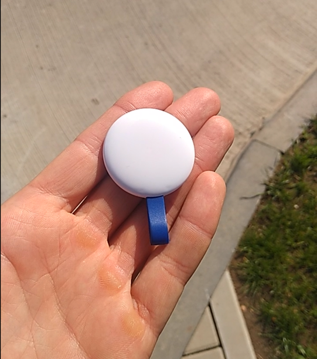

Архитектура систем контроля доступа, видеонаблюдения, домофонии, автоматического открытия ворот в квартале построена на основе оборудования компании [Hikvision](https://hikvision.ru/).  Оборудование Hikvision в Беларусь поставляет компания [Авант техно](https://avant.by/), монтаж оборудования, пусконаладочные работы, обслуживание осуществляются компанией [БайТехСервис](https://byteh.by/). В настоящее время в квартале осуществляется переход на более современный программный продукт HikCentral и доработанное программное обеспечение, которое предоставляет Hikvision.

---

## HikCentral

---

## Hik-Connect



### Сценарий использования

Чтобы иметь возможность дистанционно со смартфона открыть въездные ворота, калитку; просматривать камеры видеонаблюдения; получать сигнал звонка с домофона.

### Порядок настройки

1. Установить приложение Hik-Connect на смартфон;
2. Зарегистрироваться в приложении Hik-Connect;
3. Добавить в приложение устройство (монитор домофона) путем сканирования QR кода, находящегося на задней стенке монитора домофона;
4. Установить монитор домофона на стену в квартире на штатное место.

---

## ProxWay Mobile ID



### Сценарий использования

Чтобы открывать въездные ворота, калитки, двери в подъезд с расстояния действия Bluetooth смартфона. То есть с собой не нужно носить чип-брелок.

### Порядок настройки

1. Установить приложение Hik-Connect на смартфон;
2. Получить в товариществе QR-код, который здесь прописывается как электронный ключ на квартиру.

_Приложение для IOS и Android несколько отличаются между собой. В Android есть дополнительная функция «свободные руки», также есть открытие по включению экрана. Я пробовал, не могу сказать, что идеально работает._

---

## Мобильный идентификатор PW-tag

[Паспорт на PW-Tag](pw-tag.pdf)

### Сценарий использования

Чтобы открывать въездные ворота, калитки, двери в подъезд с расстояния действия Bluetooth либо принудительно нажатием кнопки на устройстве.

### Порядок настройки

1. Приобрести в товариществе;

---

Задать вопросы можно в канале **#hikvision**

## Ссылки

1. [Паспорт на IP домофон, который устанавливается во всех ситихаусах](cityhouse-intercom-docs.pdf)

## Контакты

1. Байтехсервис: Сергей Лучковский [+375445660993](tel:+375445660993)
