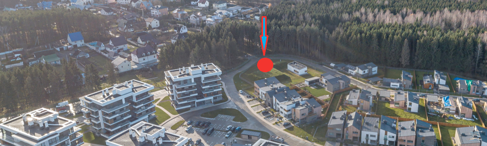
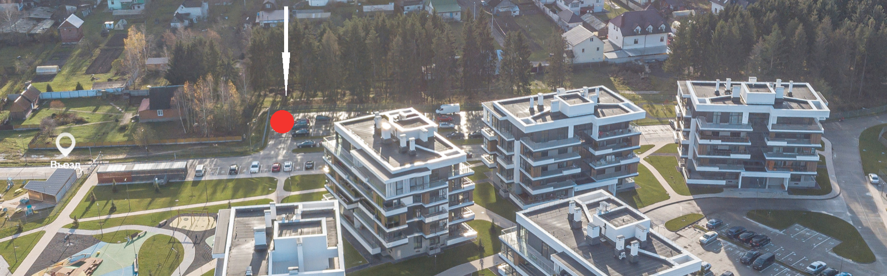

[Бюллетень для голосования июнь 2021 (pdf)](vote_43342b697b962495d96ddcd82a719d7d.pdf)

## 1

Сдать в аренду часть бетонного покрытия общей площадью 21 (двадцать один) квадратный метр, расположенный по адресу: ул. Солнечный пляж, 1 ([53.948085, 27.330669](https://www.openstreetmap.org/?mlat=53.94808&mlon=27.33067#map=19/53.94808/27.33067), район велобокса) ИП Левшиной О.О. на срок 3 (три) года для торговли продуктами питания с возможностью установки торгового павильона согласно прилагаемых рендеров. Установить арендную плату в размере 111,3 евро в т.ч. НДС 18,55 евро в месяц (5,3 евро/м.кв. с НДС). Уполномочить председателя правления товарищества подготовить и заключить договор аренды с ИП Левшиной О.О.

[Обращение ИП Левшиной О.О. о размещении торгового объекта в ТС "Квартал Пирс-1" (pdf)](vote_a45e29a219fc68d13c571a129abacb6b.pdf)

Предполагаемый к сдаче в аренду земельный участок для ИП Левшиной О.О. (житель Квартала "Пирс"), расположенный на площадке возле велобокса (Урбан-Вилла №1) + фото предполагаемого торгового объекта.

#### Решение: N/A

## 2 

Установить целевой взнос в размере 34 копейки на 1 кв.м. от общей площади жилого помещения для приобретения дополнительного оборудования детской площадки, расположенной на границе земельных участков товариществ «Квартал Пирс-1» и «Квартал Пирс-2» стоимостью до 17 400,00 руб.

#### Решение: N/A

## 3

Внести в договоры с жителями по аренде велопарковки следующие условия: 

1. Срок договора – бессрочный (с ежегодной автоматической пролонгацией). 
2. Оплату аренды осуществлять разово, на один арендный период (год), по выставленному счету, внесенному в извещение по начислению жилищно-коммунальных услуг. 
3. Установить с 01.07.2021 арендную плату одного парковочного места за один арендный период (год) равному 2 (две) базовые величины. 
4. Не осуществлять перерасчет по уже заключенным и оплаченным договорам.

#### Решение: N/A

## 4

Внести оплату вступительного взноса в извещение на оплату дополнительных жилищно-коммунальных услуг (далее ЖКУ) с календарной даты вступления в товарищество собственников. В случае наличия задолженности у члена товарищества по оплате вступительного взноса на момент принятия данного решения - внести задолженность по уплате вступительного взноса в извещение на оплату дополнительных ЖКУ ТС «Квартал Пирс-1».

#### Решение: N/A

## 5

Установить ежемесячный целевой сбор для компенсации вознаграждений
ОАО «Небанковская кредитно-финансовая организация «ЕРИП» и расчетного агента по дополнительным жилищно-коммунальным услугам (ЖКУ) в размере установленного тарифа от суммы платежа.

#### Решение: N/A

## 6

Установить ежемесячный целевой сбор для компенсации вознаграждения расчетного агента (ПКУП ЖКХ Минского района) по основным жилищно-коммунальным услугам (ЖКУ) в размере установленного тарифа от суммы платежа

#### Решение: N/A

## 7

Установить целевой взнос в размере: 1,10 (один рубль десять копеек) на 1 кв.м. жилого помещения домов типа «коттедж» и «таунхаус»; 2,00 (два рубля 00 копеек) на 1 кв.м. жилого помещения домов типа «Урбан Вилла» для погашения убытка товарищества собственников за 2020 год и первое полугодие 2021 года. Равномерно распределить целевой взнос равными долями на три месяца 2021 года: июлю-август-сентябрь.

#### Решение: N/A

## 8

Установить с 01.07.2021 ежемесячный членский взнос в размере: 0,53
(пятьдесят три копейки) на 1 кв.м. жилого помещения домов типа: «коттедж» и «таунхаус»; 0,93 (девяносто три копейки) на 1 кв.м. жилого помещения домов типа «Урбан Вилла»

#### Решение: N/A

## 9

Утвердить измененную смету на 2021 год.

[Измененная смета 2021 года (pdf)](vote_df2caeeffc1021175c65fa0d76e56971.pdf)

#### Решение: N/A

## 10

Сдать в аренду часть бетонного покрытия, общей площадью 5 кв.м., на участке: между пожарным выездом из ТС «Квартала Пирс-1» и жилым домом, расположенным по адресу: Солнечный Пляж, 21, для размещения базовой станции сотовой связи, заключив договор аренды с УП «А1» сроком на 5 лет. Уполномочить правление согласовать условия договора аренды с УП «А1», наделить председателя правления правом подписания договора с УП «А1».

#### Решение: N/A

## 11

Сдать в аренду часть бетонного покрытия, общей площадью 5 кв.м., на участке гостевой парковки слева от площадки для выгула собак, для размещения базовой станции сотовой связи, заключив договор аренды с УП «А1» сроком на 5 лет. Уполномочить правление согласовать условия договора аренды с УП «А1», наделить председателя правления правом подписания договора с УП «А1».

#### Решение: N/A
